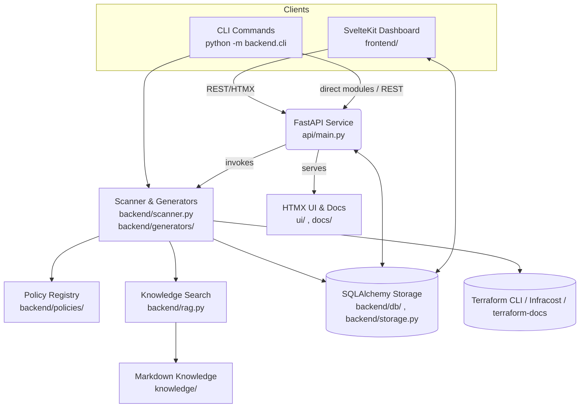

# TerraformManager — Wizard + Reviewer (Extended)

TerraformManager combines a SvelteKit dashboard, FastAPI API, and reusable backend engines to help teams generate secure Terraform and review existing infrastructure code with rich context.

**Core capabilities**
- Guided Terraform generators and blueprint bundles for AWS, Azure, and Kubernetes workloads.
- Policy scanning with autofix suggestions, HTML/CSV artifacts, drift summaries, and cost estimates powered by Infracost.
- Knowledge base search (TF‑IDF RAG), Markdown sync, and optional LLM explanations/patches.
- Authenticated API with SQL-backed storage for reports, configs, knowledge, and LLM settings.
- Automation-friendly CLI for scans, baselines, docs generation, pre-commit scaffolding, auth, and knowledge reindexing.

> On‑prem defaults to Kubernetes via the Terraform `kubernetes` provider. Bring your own providers (vSphere, Proxmox, etc.) by extending the generators or policies.

## Architecture at a glance


---

## Quick start (API)

```bash
python -m venv .venv && source .venv/bin/activate      # (Windows) .venv\Scripts\activate
pip install -r requirements.txt
python -m api  # runs uvicorn api.main:app --reload --port 8890
```

- Optional tooling unlocks extra features:
  - [Terraform CLI](https://developer.hashicorp.com/terraform/cli) for `fmt` / `validate` integrations.
  - [Infracost](https://www.infracost.io/docs/integrations/cli/) for cost estimation.
  - [`terraform-docs`](https://terraform-docs.io/) for generator documentation mirroring.

- Open http://localhost:8890 for a minimal HTMX UI.
- Save and list reports via `/scan` and `/reports`.
- Store review configs in SQLite with `/configs` endpoints.
- Sync docs from GitHub with `POST /knowledge/sync`.
- Set `TFM_SQL_ECHO=1` (or `SQLALCHEMY_ECHO=1`) to log SQL emitted by the new SQLAlchemy storage layer.

Read `docs/authentication.md` for a full walkthrough of the password + refresh-token flow and environment controls.

To require a token for all endpoints, set `TFM_API_TOKEN=...` and pass either header `X-API-Token: ...` or `Authorization: Bearer ...`. The value seeds an always-active service user (`TFM_SERVICE_USER_EMAIL`, default `service@local`). Set a custom port with `TFM_PORT` or `PORT`.

## Web Frontend (SvelteKit)

```bash
cd frontend
pnpm install
pnpm dev -- --open
```

- Defaults to `http://localhost:5173` and proxies API calls to `http://localhost:8890`; export `VITE_API_BASE` to change.
- Authenticated routes live under `(app)/` while guest flows live under `(auth)/`; tokens persist via cookies/local storage helpers.

### Authentication Settings

| Variable | Default | Purpose |
| --- | --- | --- |
| `TFM_API_TOKEN` / `API_TOKEN` | `local-dev` | Legacy single-user password required for login. |
| `TFM_JWT_SECRET` | `dev-secret-change-me` | Symmetric signing key for access tokens. |
| `TFM_REFRESH_SECRET` | falls back to `TFM_JWT_SECRET` | Optional distinct secret for refresh tokens. |
| `TFM_ACCESS_TOKEN_MINUTES` | `30` | Access token lifetime (minutes). |
| `TFM_REFRESH_TOKEN_MINUTES` | `10080` (7 days) | Refresh token lifetime (minutes). |
| `TFM_COOKIE_SECURE` | `false` | Set `true`/`1` in production to emit `Secure` cookies. |
| `TFM_COOKIE_DOMAIN` | unset | Optional domain attribute for cookie scope. |
| `TFM_COOKIE_SAMESITE` | `lax` | SameSite mode for refresh cookies (`lax`, `strict`, `none`). |
| `TFM_AUTH_REFRESH_COOKIE` | `tm_refresh_token` | Cookie name that stores the refresh token. |

Login issues a short-lived access token and a `tm_refresh_token` HttpOnly cookie. Clients must echo the refresh cookie alongside the `X-Refresh-Token-CSRF` header (returned after login/refresh) when calling `/auth/refresh`.

## CLI (for CI or local)

```bash
# Policy scan with formatting, validate, cost, and plan drift awareness
python -m backend.cli scan --path . --out report.json \
  --terraform-fmt \
  --terraform-validate \
  --cost \
  --cost-usage-file infracost-usage.yml \
  --plan-json plan.json

# Capture autofixable diffs alongside the JSON report
python -m backend.cli scan --path . --out report.json --patch-out autofix.patch

# Generate a baseline waiver file (YAML)
python -m backend.cli baseline --path .

# Scaffold pre-commit hooks (fmt/validate/tflint/checkov/infracost/docs)
python -m backend.cli precommit --out .pre-commit-config.yaml

# Generate template documentation (mirrors into docs/ and knowledge/)
python -m backend.cli docs --out docs/generators --knowledge-out knowledge/generated

# Authenticate against running API (stores access/refresh data in tm_auth.json)
python -m backend.cli auth login --email you@example.com --base-url http://localhost:8890
```

### CLI commands at a glance
- `scan` — run the reviewer with optional `terraform fmt`, `terraform validate`, Infracost cost data, drift summary (`--plan-json`), and HTML/patch artifacts.
- `baseline` — snapshot current findings into YAML/JSON for waivers.
- `precommit` — scaffold a Terraform-focused `.pre-commit-config.yaml`.
- `docs` — render Terraform-docs output for registered generators and mirror Markdown into `knowledge/` (reindexes RAG by default).
- `auth login` — capture access/refresh tokens for automation workflows (`tm_auth.json`).
- `reindex` — warm the TF-IDF knowledge index if you add Markdown outside the docs command.

To run template smoke tests with `terraform validate`, export `TFM_RUN_TERRAFORM_VALIDATE=1` before executing `python -m unittest` or the new pytest-based smoke test (`TFM_RUN_TERRAFORM_VALIDATE=1 pytest tests/test_terraform_validate_smoke.py`). Terraform must be on `PATH`; tests fall back gracefully if it is absent.

## CI (GitHub Actions)

- Workflow file: `.github/workflows/terraform-review.yml`
- Produces artifact: `terraform_review_report.json`

---

## What’s included

- `frontend/` — SvelteKit dashboard for generator, reviewer, and knowledge workflows (reviewer view now surfaces cost & drift summaries)
- `api/` — FastAPI surface (`api/main.py`) with HTMX UI mounts, auth routes, generator/knowledge endpoints, and static doc serving
- `backend/cli.py` — CLI to scan paths and write a JSON report
- `backend/scanner.py` — Static checks for AWS, Azure, K8s; syntax/HCL parse checker; optional terraform validate hook
- `backend/policies/` — Provider-specific rule registries, metadata, and helpers powering the reviewer
- `backend/costs/` — Infracost integration for monthly/hourly estimates across multiple roots
- `backend/drift/` — Terraform plan JSON parsing/summaries exposed in CLI/API reports
- `backend/db/` — SQLAlchemy engine/session helpers plus ORM definitions for configs, reports, and settings
- `backend/storage.py` — High-level helpers to persist configs, reports, and LLM settings (used by CLI & API)
- `backend/rag.py` & `backend/knowledge_sync.py` — Local TF‑IDF retrieval over `knowledge/` plus GitHub Markdown sync tooling
- `backend/validators.py` — Optional helpers for `terraform fmt` / `validate`
- `backend/utils/diff.py` — helper for unified diffs
- `backend/llm_service.py` — provider validation, caching, and response coercion for OpenAI/Azure-backed explanations/patches
- `backend/generators/` — Jinja templates, registry, docs automation, and blueprint bundler:
  - `aws_s3_bucket.tf.j2`
  - `aws_observability_baseline.tf.j2`
  - `aws_alb_waf.tf.j2`
  - `aws_eks_cluster.tf.j2` (optional IMDSv2-required launch template)
  - `aws_ecs_fargate_service.tf.j2`
  - `aws_eks_irsa_service.tf.j2`
  - `aws_rds_baseline.tf.j2`
  - `aws_rds_multi_region.tf.j2`
  - `aws_vpc_networking.tf.j2`
  - `azure_aks_cluster.tf.j2`
  - `azure_key_vault.tf.j2`
  - `azure_diagnostics_baseline.tf.j2`
  - `azure_storage_account.tf.j2`
  - `azure_vnet_baseline.tf.j2`
    - Auto-suggests diagnostics for VNets/Subnets/NSGs and emits helper outputs for private endpoints/logging.
  - `k8s_deployment.tf.j2` (On‑Prem default)
  - `k8s_namespace_baseline.tf.j2`
  - `k8s_pod_security_baseline.tf.j2`
  - `k8s_psa_namespaces.tf.j2` (supports per-namespace team overrides via `namespace,team` syntax)
  - `k8s_argo_cd_baseline.tf.j2`
  - `k8s_hpa_pdb.tf.j2`
- `knowledge/` — seed Markdown docs (Terraform language + best practices for AWS/Azure/K8s)
- `docs/report_schema.json` — report contract
- `docs/azure_diagnostics.md` — how to auto-generate diagnostics targets and consume outputs
- `sample/` — growing library of examples: S3 (`aws_s3_insecure.tf`), IAM wildcard (`aws_iam_insecure.tf`), VPC flow logs (`aws_vpc_no_flow_logs.tf`), multi-region RDS (`aws_rds_multi_region.tf`), Azure diagnostics (`azure_diagnostics_health_alert.tf`), and Kubernetes seccomp/AppArmor (`k8s_insecure_seccomp.tf`).

> Extend by adding more templates (RDS/EKS/ECS, Azure AKS/Key Vault, K8s/Helm/vSphere) and more review rules.

---

## FastAPI endpoints (summary)

- Health: GET `/health`.
- Scans: POST `/scan`, POST `/scan/upload` (multipart uploads with optional plan/cost artifacts).
- Reports: GET `/reports`, GET `/reports/{id}`, GET `/reports/{id}/html`, GET `/reports/{id}/csv`, DELETE `/reports/{id}`, GET `/ui/reports/export-zip`.
- Configs & waivers: GET `/configs`, POST `/configs`, GET `/configs/{name}`, DELETE `/configs/{name}`, POST `/preview/config-application`, GET `/preview/config-application/html`.
- Knowledge: POST `/knowledge/sync`, GET `/knowledge/search`, GET `/knowledge/doc`.
- Generators: GET `/generators/metadata`, POST `/generators/blueprints`, POST `/generators/aws/s3`, POST `/generators/azure/storage-account`.
- LLM settings: GET `/settings/llm`, POST `/settings/llm`, POST `/settings/llm/test`.
- Auth: `/auth/token`, `/auth/refresh`, `/auth/logout`, `/auth/me`, `/auth/sessions`, `/auth/sessions/{id}`, `/auth/events`, `/auth/register`, `/auth/recover` (see `api/routes/auth.py` for scope handling).
- UI & docs: GET `/`, GET `/ui/*` (HTMX views), static docs served under `/docs`.

## Docker

Build and run the API + UI without installing dependencies locally:

```bash
docker build -t terraform-manager:local .
docker run --rm -p 8890:8890 \
  -e TFM_PORT=8890 \
  -e TFM_API_TOKEN=changeme \
  -v "$(pwd)/knowledge:/app/knowledge" \
  -v "$(pwd)/data:/app/data" \
  terraform-manager:local
```

Open http://localhost:8890. To customize port, change `-p` and `TFM_PORT`.

### Docker Compose

```bash
docker compose up --build
```

This mounts `knowledge/` and `data/` for persistence and serves on port 8890.

### Blueprint bundles
- POST `/generators/blueprints` accepts a `BlueprintRequest` (see `backend/generators/models.py`) to stitch multiple registered generator components per environment.
- Payloads support `{env}` placeholders, optional Azure or S3 remote-state backends, and a configurable README/variables stub.
- Responses embed the rendered files plus a base64 ZIP archive; the SvelteKit UI streams the same structure for downloads.
- Components reuse generator slugs from `/generators/metadata`; extend the registry in `backend/generators/registry.py` when adding new templates.

### AWS ALB logging tips
- When generating the ALB baseline, toggle **Enable ALB access logging** to create a hardened logging bucket automatically.
- If your organization uses a shared log bucket, uncheck **Create and manage log bucket** and supply the shared bucket name/prefix—the template will reference it without trying to manage policies you already own.

### AWS EKS hardening
- The EKS generator now enables control plane logging for `api`, `audit`, `authenticator`, `controllerManager`, and `scheduler`.
- Select **Require IMDSv2 on nodes** to enforce metadata-token requirements via a launch template (recommended for all managed node groups).
- Use the **EKS IRSA Service Module** generator to scaffold namespaces, IRSA roles, and service accounts with least-privilege policies.

### AWS ECS service guidance
- The **ECS Fargate Service** generator emits private networking, IAM roles, and CloudWatch logging defaults rated for production.
- The reviewer flags Fargate services that still assign public IPs so you can route traffic through load balancers or NAT gateways instead.

### Kubernetes GitOps baseline
- The **Argo CD Baseline** generator provisions a restricted namespace, baseline network policies, optional quotas, and installs the official chart with hardened values (admin disabled, PodSecurity defaults, ingress optional).
- Configure the Terraform `kubernetes` and `helm` providers with cluster credentials (host/token/CA) before applying the module.
- Enable ingress when exposing the API externally; otherwise rely on the internal `argocd-server` service.

### Azure diagnostics helpers
- The diagnostics wizard can auto-populate targets for VNets, subnets, NSGs, and storage accounts—provide the subscription ID and resource names to generate the correct resource IDs.
- Generated Terraform emits outputs (`log_analytics_workspace_id`, storage account helpers, diagnostic maps) to streamline private endpoint creation and downstream automation.
- The AKS generator keeps the Azure Policy add-on enabled by default; the reviewer now flags clusters that disable it.
- Control plane diagnostics must include `kube-apiserver`, audit/admin, controller-manager, scheduler, cluster-autoscaler, and guard logs—the reviewer verifies every category is enabled.
- The Review tab now surfaces severity counts and highlights when `tfreview.yaml` severity gates fail so you can react quickly.

### HTML Reporting
- `backend.cli scan` supports `--html-out report.html` to render findings, severities, and thresholds as a self-contained HTML summary.
- Combine with `--patch-out` to ship both a human-friendly report and ready-to-apply diffs in CI artifacts.

### LLM assistance
- Configure providers via `/settings/llm` (UI) or CLI flags (`--llm`, `--llm-model`, `--llm-explanations`, `--llm-patches`); settings persist in SQLite.
- `backend.llm_service` validates environment hints (OpenAI or Azure), reuses a file-backed cache (`LLM_CACHE_DIR`), and extracts JSON payloads from model responses.
- Explanations and patch proposals are optional—keep `enable_explanations`/`enable_patches` off when running in air-gapped mode.

---

## Roadmap (suggested)
- Add vSphere VM generator & checks.
- Add more Azure/AWS/K8s rules (CIS aligned).
- Generate `.patch` files for “one‑click fix” with `git apply`.
- GitHub App that comments on PRs using the JSON report.

- Diagnostics fixture for integration: see docs/integration-fixtures.md

- PodSecurity namespace generator usage: see docs/k8s_podsecurity.md
