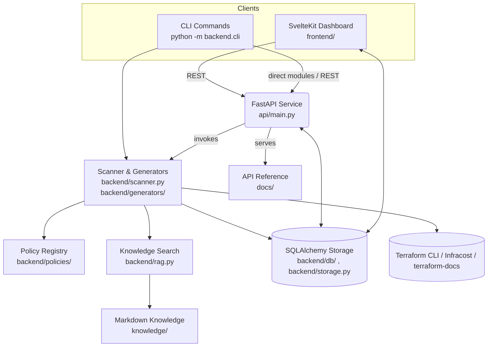

# TerraformManager — Wizard + Reviewer (Extended)

TerraformManager is an IaC co-pilot that pairs a SvelteKit workspace, FastAPI service, and reusable Python engines so teams can generate secure Terraform blueprints, review existing infrastructure, and curate reusable assets with context.

**Core capabilities**
- Opinionated Terraform generators and blueprint bundles for AWS, Azure, and Kubernetes workloads with metadata-aware inputs.
- Drift, policy, and cost scanning with autofix suggestions, HTML/CSV exports, terraform validate hooks, and Infracost deltas.
- Knowledge base search (TF‑IDF RAG), Markdown sync from GitHub, and optional LLM-backed explanations or remediation patches.
- Authenticated API with SQL-backed storage for projects, runs, reports, configs, generator assets, knowledge articles, and LLM settings.
- Browser workspace for managing projects end-to-end—edit metadata, browse run artifacts, promote outputs into versioned assets, and cross-link reviews with saved reports.
- Automation-friendly CLI covering scans, baselines, docs generation, blueprint bundles, auth helpers, and knowledge reindexing for CI/CD.

> On‑prem defaults to Kubernetes via the Terraform `kubernetes` provider. Bring your own providers (vSphere, Proxmox, etc.) by extending the generators or policies.

## Architecture at a glance

---

## Project workspace & file storage
- **Canonical workspace** — Every project creates a folder under `data/projects/<slug>/` managed by `backend/storage.py`. All uploaded Terraform sources, rendered generators, scan artifacts, and run metadata live inside this tree.
- **API guardrails** — Endpoints such as `POST /scan`, `/projects/{id}/runs`, and the artifact APIs resolve user-supplied paths relative to the workspace and reject absolute/parent-traversal paths. Upload flows (e.g., `/scan/upload`) first materialise files inside the owning project’s run directory before scanning.
- **CLI alignment** — The CLI still supports scanning arbitrary local directories, but when you want parity with the hosted workflow point commands at the appropriate workspace path (for example, `python -m backend.cli scan --path data/projects/my-project`).
- **Runtime configuration** — Override the root via `TERRAFORM_MANAGER_PROJECTS_ROOT` (consumed by `backend.storage.get_projects_root`) if you mount persistent storage elsewhere. All documentation below assumes the default `data/projects` root is available.

## Tech stack

- **Backend**: Python 3.11+, FastAPI with Uvicorn, Pydantic v2, SQLAlchemy 2.0 (SQLite default), Jinja2 generators, python-jose JWT auth, Passlib (bcrypt), httpx.
- **Analysis & AI**: python-hcl2 for Terraform parsing, scikit-learn TF-IDF search, pandas/numpy reporting helpers, optional OpenAI/Azure LLM integration with caching.
- **Frontend**: SvelteKit 2 (Svelte 5 + TypeScript), Tailwind CSS, Vite tooling, Testing Library + Vitest, packaged with PNPM.
- **Infrastructure & Tooling**: Python CLI + pytest suite, Terraform CLI integrations, Infracost for cost deltas, terraform-docs for generator docs.

---

## Quick start (API)

```bash
python -m venv .venv && source .venv/bin/activate      # (Windows) .venv\Scripts\activate
pip install -r requirements.txt
python -m api  # runs uvicorn api.main:app --reload --port 8890
```

### Logging + Observability

TerraformManager emits structured JSON logs via `backend/utils/logging.py`. By default they go to `stdout` and to `logs/terraform-manager.log` (rotating 5×5 MB). Tune with:

| Variable | Default | Description |
| --- | --- | --- |
| `TFM_LOG_LEVEL` | `INFO` | Global log level (DEBUG/INFO/WARN/ERROR). |
| `TFM_LOG_DIR` | `logs` | Directory for the rotating file sink. |
| `TFM_LOG_FILE` | `<TFM_LOG_DIR>/terraform-manager.log` | Override file path; set to `stdout`/`stderr`/`none` to disable. |
| `TFM_LOG_FILE_MAX_BYTES` | `5242880` | Rotate threshold per file. |
| `TFM_LOG_FILE_BACKUP_COUNT` | `5` | Number of rotated files to retain. |
| `TFM_PORT` / `PORT` | `8890` | Backend bind port (supervisor + frontend detection honor it). |
| `PUBLIC_API_BASE` | auto-detected | Force the frontend to hit a specific API origin (e.g., `https://reviewer.example.com`). |
| `PUBLIC_API_PORT` | derived from `TFM_PORT` | When auto-detecting, override just the port exposed by the API. |
| `TFM_ALLOWED_ORIGINS` | local dev hosts | Comma-separated dashboard origins allowed when browsers send credentialed requests. |
| `TFM_TRUSTED_HOSTS` | unset | Optional comma-separated hostnames/patterns enforced via FastAPI's `TrustedHostMiddleware`. |

The log payload already carries request IDs, HTTP metadata, scan summaries, etc. Ship them to your aggregator by tailing `logs/terraform-manager.log` with Fluent Bit/Vector/Logstash or by binding `stdout` into your container logging pipeline. All JSON lines conform to a stable schema: `timestamp`, `level`, `logger`, `message`, and nested `context` / `extra` dictionaries.

### API origin policy

When the frontend is deployed on a different domain, browsers include cookies and bearer tokens in cross-origin calls only if the API explicitly allows the requesting origin. TerraformManager now reads `TFM_ALLOWED_ORIGINS` (comma-delimited) before wiring FastAPI's CORS middleware; the default covers local SvelteKit hosts (`http://localhost:5173`, `http://127.0.0.1:5173`, etc.). Override it in production so only your dashboard URLs receive credentialed responses:

```bash
export TFM_ALLOWED_ORIGINS="https://reviewer.example.com, https://ops.example.com"

# Optional: reject requests whose Host header is not on this list
export TFM_TRUSTED_HOSTS="reviewer.example.com, api.review.example.com"
```

Restart the API after changing these variables. If you expose the API publicly (e.g., via a load balancer), keep the allowlist tight so browsers cannot relay credentials from other origins.

**Common tasks**

```bash
# Raise log level for a debugging session
export TFM_LOG_LEVEL=DEBUG

# Point the structured log file somewhere else (and disable stdout logging)
export TFM_LOG_DIR=/var/log/tfm
export TFM_LOG_FILE=/var/log/tfm/api.jsonl

# Switch the API to port 9000 and let the frontend follow automatically
export TFM_PORT=9000
export PUBLIC_API_PORT=9000

# When running behind a reverse proxy, force the SPA to target the external URL
export PUBLIC_API_BASE="https://tfm.example.com"

# Tear down environment overrides
unset TFM_LOG_LEVEL TFM_LOG_DIR TFM_LOG_FILE TFM_LOG_FILE_MAX_BYTES \
      TFM_LOG_FILE_BACKUP_COUNT TFM_PORT PUBLIC_API_BASE PUBLIC_API_PORT
```

### Service manager

Use the bundled supervisor to run, stop, and inspect the backend/frontend processes without juggling terminals:

```bash
# Start API + frontend
python3 scripts/service_manager.py start all

# Check process state and log locations
python3 scripts/service_manager.py status

# Tail JSON logs for a single service
python3 scripts/service_manager.py logs api --follow

# Restart just the frontend
python3 scripts/service_manager.py restart frontend
```

The manager automatically loads `.env`, writes PID metadata under `logs/service-manager/`, and streams stdout/err to `logs/api-service.log` and `logs/frontend-service.log` so you can feed them into the same observability pipeline.

- When you access the UI from another machine, the frontend now auto-detects the API host using the page's origin. Override the behavior with `PUBLIC_API_BASE` or set `PUBLIC_API_PORT` in `.env` if your backend is not running on port `8890`.

- Optional tooling unlocks extra features:
  - [Terraform CLI](https://developer.hashicorp.com/terraform/cli) for `fmt` / `validate` integrations.
  - [Infracost](https://www.infracost.io/docs/integrations/cli/) for cost estimation.
  - [`terraform-docs`](https://terraform-docs.io/) for generator documentation mirroring.

- API available at http://localhost:8890 (SvelteKit frontend served separately via `frontend/`).
- Save and list reports via `/scan` and `/reports`.
- Store review configs in SQLite with `/configs` endpoints.
- Sync docs from GitHub with `POST /knowledge/sync`.
- Set `TFM_SQL_ECHO=1` (or `SQLALCHEMY_ECHO=1`) to log SQL emitted by the new SQLAlchemy storage layer.

Read `docs/authentication.md` for a full walkthrough of the password + refresh-token flow and environment controls.

To require a token for all endpoints, set `TFM_API_TOKEN=...` and pass either header `X-API-Token: ...` or `Authorization: Bearer ...`. The value seeds an always-active service user (`TFM_SERVICE_USER_EMAIL`, default `service@local`). Set a custom port with `TFM_PORT` or `PORT`.

## Web Frontend (SvelteKit)

```bash
cd frontend
pnpm install
pnpm dev -- --open
```

- Defaults to `http://localhost:5173` and proxies API calls to `http://localhost:8890`; export `VITE_API_BASE` to change.
- Authenticated routes live under `(app)/` while guest flows live under `(auth)/`; tokens persist via cookies/local storage helpers.
- The **Projects** workspace lets you create, edit, and delete project folders entirely in the browser, browse recent runs, upload or delete artifacts, and download generator/review outputs without touching the CLI. Select a project and scroll to the "Project artifacts" panel to manage files directly from the UI.
- Promoting an artifact now opens a structured dialog where you can capture asset type, tags, notes, and JSON metadata before saving it to the library. The dialog remembers your last-used defaults, suggests tags from existing assets, and the library view lets you edit metadata in-place as requirements evolve.
- Library diffs support unified or side-by-side layouts, an “ignore whitespace” toggle, per-file status filters, and copy/download helpers so reviewers can zero in on the exact Terraform files that changed.
- The library view now includes asset-type filters (e.g., Terraform configs vs scan reports) plus version validation badges and manifest browsers. Every generated file is tracked with checksums, sizes, and media types so you can diff, download, or audit bundles without leaving the UI.
- Server-side generator runs (UI/CLI/API) record validation summaries and block promotion when `terraform fmt -check` fails unless you explicitly use the new force-save override for exceptional situations.

## Linting & Formatting

- **Python** — install dev tools with `pip install -r requirements-dev.txt` (keeps runtime deps separate) and run `scripts/lint.py`. The helper wraps `ruff check api backend scripts tests` and will exit non-zero on violations. Pass `--fix` to auto-apply safe Ruff fixes.
- **Frontend** — `scripts/lint.py` also shells out to `pnpm lint`, which synchronises SvelteKit, loads `frontend/eslint.config.js`, and runs ESLint across `.ts` and `.svelte` files. Existing warnings remain visible but will not fail CI until you tighten the rules.
- Run lint components independently if needed: `python -m ruff check api backend scripts tests` or `cd frontend && pnpm lint`.
- Adjust project-wide Ruff behaviour via `pyproject.toml` and ESLint rules in `frontend/eslint.config.js`.

### Authentication Settings

| Variable | Default | Purpose |
| --- | --- | --- |
| `TFM_API_TOKEN` / `API_TOKEN` | `local-dev` | Legacy single-user password required for login. |
| `TFM_JWT_SECRET` | `dev-secret-change-me` | Symmetric signing key for access tokens. |
| `TFM_REFRESH_SECRET` | falls back to `TFM_JWT_SECRET` | Optional distinct secret for refresh tokens. |
| `TFM_ACCESS_TOKEN_MINUTES` | `30` | Access token lifetime (minutes). |
| `TFM_REFRESH_TOKEN_MINUTES` | `10080` (7 days) | Refresh token lifetime (minutes). |
| `TFM_COOKIE_SECURE` | `false` | Set `true`/`1` in production to emit `Secure` cookies. |
| `TFM_COOKIE_DOMAIN` | unset | Optional domain attribute for cookie scope. |
| `TFM_COOKIE_SAMESITE` | `lax` | SameSite mode for refresh cookies (`lax`, `strict`, `none`). |
| `TFM_AUTH_REFRESH_COOKIE` | `tm_refresh_token` | Cookie name that stores the refresh token. |

Login issues a short-lived access token and a `tm_refresh_token` HttpOnly cookie. Clients must echo the refresh cookie alongside the `X-Refresh-Token-CSRF` header (returned after login/refresh) when calling `/auth/refresh`.

## CLI (for CI or local)

```bash
# Policy scan with formatting, validate, cost, and plan drift awareness
python -m backend.cli scan --path . --out report.json \
  --terraform-fmt \
  --terraform-validate \
  --cost \
  --cost-usage-file infracost-usage.yml \
  --plan-json plan.json

# Capture autofixable diffs alongside the JSON report
python -m backend.cli scan --path . --out report.json --patch-out autofix.patch

# Generate a baseline waiver file (YAML)
python -m backend.cli baseline --path .

# Scaffold pre-commit hooks (fmt/validate/tflint/checkov/infracost/docs)
python -m backend.cli precommit --out .pre-commit-config.yaml

# Generate template documentation (mirrors into docs/ and knowledge/)
python -m backend.cli docs --out docs/generators --knowledge-out knowledge/generated

# Authenticate against running API (stores access/refresh data in tm_auth.json)
python -m backend.cli auth login --email you@example.com --base-url http://localhost:8890

# Invoke a registered generator via the API (auto-saves run + library asset)
python -m backend.cli project generator \
  --project-id <uuid> \
  --slug aws/s3-secure-bucket \
  --payload payloads/s3-secure-bucket.json \
  --asset-name "Platform Logs Bucket" \
  --tags "terraform,baseline"

# Override validation failures from the CLI when you intentionally want to save the result
python -m backend.cli project generator \
  --project-id <uuid> \
  --slug aws/s3-secure-bucket \
  --payload payloads/s3-secure-bucket.json \
  --force-save
```

> Tip: The Projects UI in the SvelteKit dashboard now covers workspace creation, editing, deletion, artifact browsing, and uploading new files. Reach for the CLI when you want automation, CI integration, or scripted workloads.

### CLI commands at a glance
- `scan` — run the reviewer with optional `terraform fmt`, `terraform validate`, Infracost cost data, drift summary (`--plan-json`), and HTML/patch artifacts.
- `baseline` — snapshot current findings into YAML/JSON for waivers.
- `precommit` — scaffold a Terraform-focused `.pre-commit-config.yaml`.
- `docs` — render Terraform-docs output for registered generators and mirror Markdown into `knowledge/` (reindexes RAG by default).
- `auth login` — capture access/refresh tokens for automation workflows (`tm_auth.json`).
- `reindex` — warm the TF-IDF knowledge index if you add Markdown outside the docs command.

To run template smoke tests with `terraform validate`, export `TFM_RUN_TERRAFORM_VALIDATE=1` before executing `python -m unittest` or the new pytest-based smoke test (`TFM_RUN_TERRAFORM_VALIDATE=1 pytest tests/test_terraform_validate_smoke.py`). Terraform must be on `PATH`; tests fall back gracefully if it is absent.

## CI (GitHub Actions)

- Workflow file: `.github/workflows/terraform-review.yml`
- Produces artifact: `terraform_review_report.json`

---

## What’s included

- `frontend/` — SvelteKit dashboard for generator, reviewer, and knowledge workflows (reviewer view now surfaces cost & drift summaries)
- `api/` — FastAPI surface (`api/main.py`) exposing auth, scan/report, generator, blueprint, and knowledge endpoints; static docs served under `/docs`
- `backend/cli.py` — CLI to scan paths and write a JSON report
- `backend/scanner.py` — Static checks for AWS, Azure, K8s; syntax/HCL parse checker; optional terraform validate hook
- `backend/policies/` — Provider-specific rule registries, metadata, and helpers powering the reviewer
- `backend/costs/` — Infracost integration for monthly/hourly estimates across multiple roots
- `backend/drift/` — Terraform plan JSON parsing/summaries exposed in CLI/API reports
- `backend/db/` — SQLAlchemy engine/session helpers plus ORM definitions for configs, reports, and settings
- `backend/storage.py` — High-level helpers to persist configs, reports, and LLM settings (used by CLI & API)
- `backend/rag.py` & `backend/knowledge_sync.py` — Local TF‑IDF retrieval over `knowledge/` plus GitHub Markdown sync tooling
- `backend/validators.py` — Optional helpers for `terraform fmt` / `validate`
- `backend/utils/diff.py` — helper for unified diffs
- `backend/llm_service.py` — provider validation, caching, and response coercion for OpenAI/Azure-backed explanations/patches
- `backend/generators/` — Jinja templates, registry, docs automation, and blueprint bundler:
  - `aws_s3_bucket.tf.j2`
  - `aws_observability_baseline.tf.j2`
  - `aws_alb_waf.tf.j2`
  - `aws_eks_cluster.tf.j2` (optional IMDSv2-required launch template)
  - `aws_ecs_fargate_service.tf.j2`
  - `aws_eks_irsa_service.tf.j2`
  - `aws_rds_baseline.tf.j2`
  - `aws_rds_multi_region.tf.j2`
  - `aws_vpc_networking.tf.j2`
  - `azure_aks_cluster.tf.j2`
  - `azure_key_vault.tf.j2`
  - `azure_diagnostics_baseline.tf.j2`
  - `azure_servicebus_namespace.tf.j2`
  - `azure_function_app.tf.j2`
  - `azure_api_management.tf.j2`
  - `azure_storage_account.tf.j2`
  - `azure_servicebus_namespace.tf.j2`
  - `azure_vnet_baseline.tf.j2`
    - Auto-suggests diagnostics for VNets/Subnets/NSGs and emits helper outputs for private endpoints/logging.
  - `k8s_deployment.tf.j2` (On‑Prem default)
  - `k8s_namespace_baseline.tf.j2`
  - `k8s_pod_security_baseline.tf.j2`
  - `k8s_psa_namespaces.tf.j2` (supports per-namespace team overrides via `namespace,team` syntax)
  - `k8s_argo_cd_baseline.tf.j2`
  - `k8s_hpa_pdb.tf.j2`
- `knowledge/` — seed Markdown docs (Terraform language + best practices for AWS/Azure/K8s)
- `docs/report_schema.json` — report contract
- `docs/azure_diagnostics.md` — how to auto-generate diagnostics targets and consume outputs
- `sample/` — growing library of examples: S3 (`aws_s3_insecure.tf`), IAM wildcard (`aws_iam_insecure.tf`), VPC flow logs (`aws_vpc_no_flow_logs.tf`), multi-region RDS (`aws_rds_multi_region.tf`), Azure diagnostics (`azure_diagnostics_health_alert.tf`), and Kubernetes seccomp/AppArmor (`k8s_insecure_seccomp.tf`).

> Extend by adding more templates (RDS/EKS/ECS, Azure AKS/Key Vault, K8s/Helm/vSphere) and more review rules.

---

## FastAPI endpoints (summary)

- **Workspace scope**: All path-based operations are constrained to the managed workspace described above. API clients must reference project IDs/slugs or files previously uploaded into `data/projects/<slug>/…`; direct access to arbitrary filesystem paths is blocked.
- Health: GET `/health`.
- Scans: POST `/scan`, POST `/scan/upload` (multipart uploads with optional plan/cost artifacts).
- Reports: GET `/reports`, GET `/reports/{id}`, GET `/reports/{id}/html`, GET `/reports/{id}/csv`, DELETE `/reports/{id}`.
- Configs & waivers: GET `/configs`, POST `/configs`, GET `/configs/{name}`, DELETE `/configs/{name}`, POST `/preview/config-application`, GET `/preview/config-application/html`.
- Knowledge: POST `/knowledge/sync`, GET `/knowledge/search`, GET `/knowledge/doc`.
- Generators: GET `/generators/metadata`, POST `/generators/blueprints`, POST `/generators/aws/s3`, POST `/generators/azure/storage-account`, POST `/generators/azure/servicebus`, POST `/generators/azure/function-app`, POST `/generators/azure/api-management`.
- Projects & runs: GET `/projects`, POST `/projects`, GET/PATCH `/projects/{id}`, DELETE `/projects/{id}`, GET `/projects/{id}/runs`, POST `/projects/{id}/runs`, PATCH `/projects/{id}/runs/{run_id}`, artifact list/upload/download/delete under `/projects/{id}/runs/{run_id}/artifacts`.
- LLM settings: GET `/settings/llm`, POST `/settings/llm`, POST `/settings/llm/test`.
- Auth: `/auth/token`, `/auth/refresh`, `/auth/logout`, `/auth/me`, `/auth/sessions`, `/auth/sessions/{id}`, `/auth/events`, `/auth/register`, `/auth/recover` (see `api/routes/auth.py` for scope handling).
- Root & docs: GET `/` (API metadata), static docs served under `/docs`.

## Docker

Build and run the API + UI without installing dependencies locally:

```bash
docker build -t terraform-manager:local .
docker run --rm -p 8890:8890 \
  -e TFM_PORT=8890 \
  -e TFM_API_TOKEN=changeme \
  -v "$(pwd)/knowledge:/app/knowledge" \
  -v "$(pwd)/data:/app/data" \
  terraform-manager:local
```

Open http://localhost:8890. To customize port, change `-p` and `TFM_PORT`.

### Docker Compose

```bash
docker compose up --build
```

This mounts `knowledge/` and `data/` for persistence and serves on port 8890.

### Blueprint bundles
- POST `/generators/blueprints` accepts a `BlueprintRequest` (see `backend/generators/models.py`) to stitch multiple registered generator components per environment.
- Payloads support `{env}` placeholders, optional Azure or S3 remote-state backends, and a configurable README/variables stub.
- Responses embed the rendered files plus a base64 ZIP archive; the SvelteKit UI streams the same structure for downloads.
- Components reuse generator slugs from `/generators/metadata`; extend the registry in `backend/generators/registry.py` when adding new templates.

### AWS ALB logging tips
- When generating the ALB baseline, toggle **Enable ALB access logging** to create a hardened logging bucket automatically.
- If your organization uses a shared log bucket, uncheck **Create and manage log bucket** and supply the shared bucket name/prefix—the template will reference it without trying to manage policies you already own.

### AWS EKS hardening
- The EKS generator now enables control plane logging for `api`, `audit`, `authenticator`, `controllerManager`, and `scheduler`.
- Select **Require IMDSv2 on nodes** to enforce metadata-token requirements via a launch template (recommended for all managed node groups).
- Use the **EKS IRSA Service Module** generator to scaffold namespaces, IRSA roles, and service accounts with least-privilege policies.

### AWS ECS service guidance
- The **ECS Fargate Service** generator emits private networking, IAM roles, and CloudWatch logging defaults rated for production.
- The reviewer flags Fargate services that still assign public IPs so you can route traffic through load balancers or NAT gateways instead.

### Kubernetes GitOps baseline
- The **Argo CD Baseline** generator provisions a restricted namespace, baseline network policies, optional quotas, and installs the official chart with hardened values (admin disabled, PodSecurity defaults, ingress optional).
- Configure the Terraform `kubernetes` and `helm` providers with cluster credentials (host/token/CA) before applying the module.
- Enable ingress when exposing the API externally; otherwise rely on the internal `argocd-server` service.

### Azure diagnostics helpers
- The diagnostics wizard can auto-populate targets for VNets, subnets, NSGs, and storage accounts—provide the subscription ID and resource names to generate the correct resource IDs.
- Generated Terraform emits outputs (`log_analytics_workspace_id`, storage account helpers, diagnostic maps) to streamline private endpoint creation and downstream automation.
- The AKS generator keeps the Azure Policy add-on enabled by default; the reviewer now flags clusters that disable it.
- Control plane diagnostics must include `kube-apiserver`, audit/admin, controller-manager, scheduler, cluster-autoscaler, and guard logs—the reviewer verifies every category is enabled.
- The Review tab now surfaces severity counts and highlights when `tfreview.yaml` severity gates fail so you can react quickly.

### HTML Reporting
- `backend.cli scan` supports `--html-out report.html` to render findings, severities, and thresholds as a self-contained HTML summary.
- Combine with `--patch-out` to ship both a human-friendly report and ready-to-apply diffs in CI artifacts.

### LLM assistance
- Configure providers via `/settings/llm` (UI) or CLI flags (`--llm`, `--llm-model`, `--llm-explanations`, `--llm-patches`); settings persist in SQLite.
- `backend.llm_service` validates environment hints (OpenAI or Azure), reuses a file-backed cache (`LLM_CACHE_DIR`), and extracts JSON payloads from model responses.
- Explanations and patch proposals are optional—keep `enable_explanations`/`enable_patches` off when running in air-gapped mode.

---

## Roadmap (suggested)
- Add vSphere VM generator & checks.
- Add more Azure/AWS/K8s rules (CIS aligned).
- Generate `.patch` files for “one‑click fix” with `git apply`.
- GitHub App that comments on PRs using the JSON report.

- Diagnostics fixture for integration: see docs/integration-fixtures.md

- PodSecurity namespace generator usage: see docs/k8s_podsecurity.md
