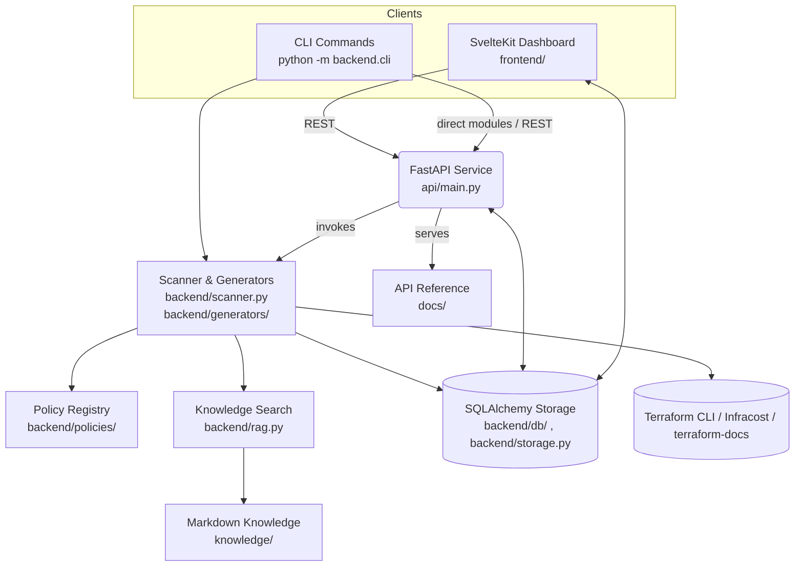

# System Architecture

TerraformManager combines a FastAPI service, reusable backend engines, and a SvelteKit dashboard to deliver Terraform generation, review, and reporting workflows. The following sections document the major subsystems so new contributors can orient themselves quickly.

## Overview
- **Frontend (`frontend/`)** renders generators, reviewer dashboards, knowledge search, and LLM configuration. Typed API clients live in `src/lib/api`.
- **API (`api/main.py`)** exposes scan/report endpoints, generator metadata, blueprint bundling, knowledge search, and LLM settings. Routes from `api/routes/auth.py` handle login, refresh rotation, and session management.
- **Backend engines (`backend/`)** provide the reusable logic invoked by both the CLI and API, including the scanner, policies, cost/drift helpers, knowledge retrieval, and generator templates.

## Architecture diagram

## Scanning pipeline
`backend/scanner.py` orchestrates the review flow:
- Terraform files are normalised and dispatched to provider-specific policies located under `backend/policies/`.
- Findings carry rich metadata (remediation, knowledge references) and support severity gating driven by `tfreview.yaml`.
- Optional integrations plug in through keyword arguments:
  - `backend/costs/infracost.py` runs Infracost across root modules when `--cost` is enabled.
  - `backend/drift/plan.py` parses `terraform show -json` output to produce action counts and change listings.
  - `backend/validators.py` drives `terraform fmt`/`terraform validate` when the CLI flags are set.
  - `backend.llm_service` validates provider configuration, warms a JSON cache (`LLM_CACHE_DIR`), and orchestrates model prompts for explanations or patch suggestions.
- Reports render to multiple formats: `backend/report_html.py`, `backend/report_csv.py`, and unified diffs via `backend/utils/diff.py`.

## Persistence & storage
- SQLAlchemy models live in `backend/db/models.py`; `backend/storage.py` wraps CRUD for reports, configs, and settings, while `backend/db/session.py` manages session scopes and database initialisation.
- The API seeds a service user when `TFM_API_TOKEN` is configured (`api/main.py::_ensure_service_user`) so automation can authenticate without manual signup.
- Settings such as LLM provider choices are persisted through `upsert_setting` and surfaced via `/settings/llm`.
- **Project workspace root** — All user-managed Terraform sources and artifacts live under `data/projects/<slug>/` (configurable via `TERRAFORM_MANAGER_PROJECTS_ROOT`). Helpers like `get_projects_root` ensure the directory tree exists, while `create_project_run` and artifact APIs keep scan uploads confined to the active project’s run directory. API endpoints that accept filesystem paths must resolve them relative to this workspace and reject any attempt to escape the managed tree.

## Knowledge search & sync
- `backend/knowledge_sync.py` clones or updates Git repositories containing Markdown, normalises their placement under `knowledge/`, and returns metadata used by `/knowledge/sync`.
- `backend/rag.py` builds a TF-IDF index (`warm_index`) and retrieves scored snippets for `/knowledge/search`.
- Knowledge documents can be mirrored automatically by `python -m backend.cli docs`, which regenerates Terraform-docs output and optionally reindexes the knowledge base.

## Generators & blueprint bundles
- Jinja templates under `backend/generators/*.tf.j2` cover AWS, Azure, and Kubernetes baselines. Tests in `tests/test_generators_render.py` validate key toggles.
- `backend/generators/registry.py` registers the API-facing generators. Extend the registry when introducing new template models so `/generators/metadata` and the docs CLI stay consistent.
- `backend/generators/models.py` defines typed payloads, remote state helpers, and the `BlueprintRequest` model. Remote state blocks support environment overrides and `{env}` placeholders.
- `backend/generators/blueprints.py` assembles multi-environment bundles, emits optional README/variables stubs, and returns a base64 ZIP for `/generators/blueprints`.
- `backend/generators/docs.py` invokes `terraform-docs` to emit Markdown reference material and mirrors it into the knowledge base when requested.

## CLI & automation
`backend/cli.py` exposes several subcommands:
- `scan` — policy review with optional fmt/validate, cost, drift, HTML, and patch outputs. LLM preferences persist across invocations.
- `baseline` — captures current findings to YAML/JSON for waiver files.
- `precommit` — scaffolds a Terraform-focused `.pre-commit-config.yaml`.
- `docs` — regenerates Markdown for all registered generators and optionally mirrors into `knowledge/`.
- `auth login` — interactive helper to retrieve access/refresh tokens and store them in `tm_auth.json`.
- `reindex` — rebuilds the TF-IDF cache when knowledge articles are added manually.

## Authentication & sessions
- `api/routes/auth.py` handles password login, refresh rotation, logout, session listings, and audit events. Refresh cookies honour `TFM_COOKIE_*` settings and rotate automatically after each use.
- `backend/auth/tokens.py` centralises password hashing, JWT issuance, and scope validation. Rate limiting is enforced via `backend/auth/limiter.py`.
- CLI automation can combine `python -m backend.cli auth login` with `TM_AUTH_FILE` to inject bearer tokens into scan requests transparently.
