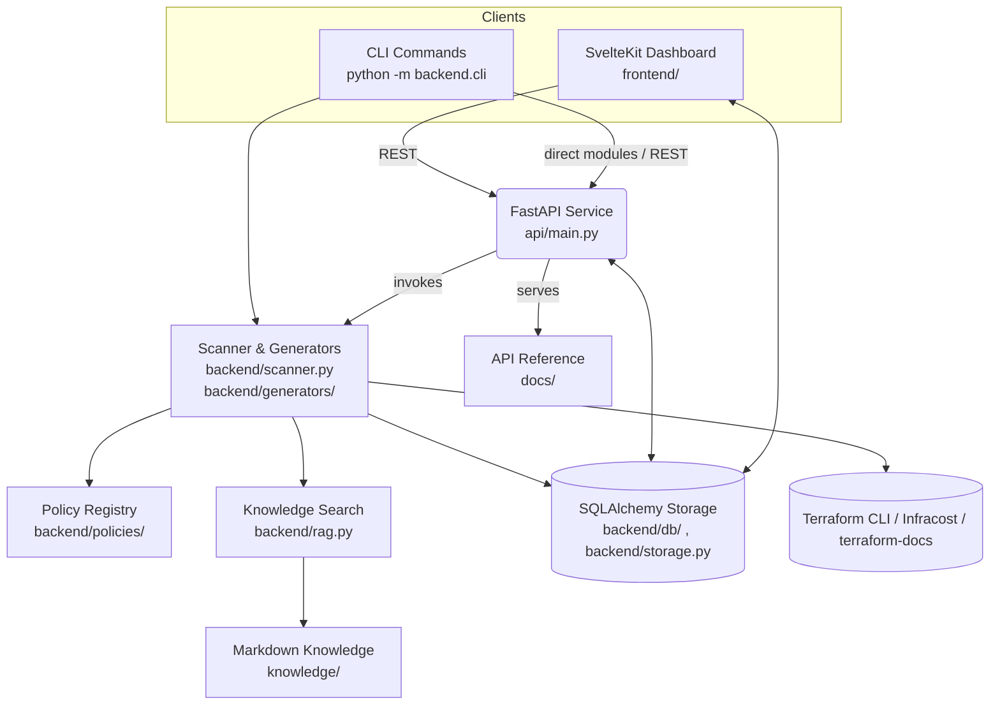

# Architecture Overview

TerraformManager combines a FastAPI service, reusable backend engines, and a SvelteKit dashboard to deliver Terraform generation, review, and reporting workflows.

## System Components

### Frontend (`frontend/`)
- **Framework**: SvelteKit 2 with Svelte 5 and TypeScript
- **Styling**: Tailwind CSS
- **Features**:
  - Generator wizards for AWS, Azure, and Kubernetes
  - Review dashboards with cost and drift visualization
  - Knowledge base search interface
  - Project workspace management
  - LLM configuration and settings
- **API Clients**: Typed API clients in `src/lib/api`
- **Routes**:
  - `(app)/` - Authenticated dashboard pages
  - `(auth)/` - Guest/login flows

### API Service (`api/main.py`)
- **Framework**: FastAPI with Uvicorn
- **Features**:
  - Scan/report endpoints with multiple export formats
  - Generator metadata and blueprint bundling
  - Knowledge search and GitHub sync
  - LLM settings and testing
  - Project workspace CRUD operations
  - Authentication and session management
- **Static Docs**: Served under `/docs`
- **Middleware**: CORS, rate limiting, trusted hosts

### Backend Engines (`backend/`)
Reusable logic invoked by both CLI and API:

- **Scanner** (`scanner.py`) - Policy-based infrastructure review
- **Policies** (`policies/`) - Provider-specific security rules
- **Generators** (`generators/`) - Jinja2 Terraform templates
- **Knowledge** (`rag.py`) - TF-IDF retrieval over Markdown docs
- **Storage** (`storage.py`) - High-level persistence layer
- **Database** (`db/`) - SQLAlchemy models and session management
- **Validators** (`validators.py`) - Terraform fmt/validate integration
- **Costs** (`costs/`) - Infracost integration
- **Drift** (`drift/`) - Terraform plan JSON parsing
- **LLM Service** (`llm_service.py`) - OpenAI/Azure integration
- **CLI** (`cli.py`) - Command-line interface

## Architecture Diagram



## Data Flow

### Scanning Pipeline

1. **Input**: Terraform files from filesystem or upload
2. **Normalization**: Files are parsed using python-hcl2
3. **Policy Dispatch**:
   - Files dispatched to provider-specific policies (`backend/policies/`)
   - Findings carry metadata (remediation, knowledge refs, severity)
4. **Optional Integrations**:
   - **Cost Analysis**: `backend/costs/infracost.py` runs Infracost across root modules
   - **Drift Detection**: `backend/drift/plan.py` parses `terraform show -json` output
   - **Validation**: `backend/validators.py` runs `terraform fmt`/`validate`
   - **LLM Service**: Generates explanations and patch suggestions
5. **Output**: Reports in JSON/HTML/CSV formats

### Generator Pipeline

1. **Input**: User configuration via web form or JSON payload
2. **Template Selection**: Registry lookup in `backend/generators/registry.py`
3. **Rendering**: Jinja2 template rendering with validation
4. **Validation**: Optional `terraform fmt -check` enforcement
5. **Storage**: Files saved to project workspace or returned directly
6. **Output**: Generated Terraform code, optionally bundled as ZIP

## Data Storage

### Database (SQLite)
Located at `data/app.db` (configurable via `TERRAFORM_MANAGER_PROJECTS_ROOT`)

**Tables**:
- `users` - Authentication users and scopes
- `reports` - Scan results with metadata
- `report_comments` - User comments on findings
- `configs` - Review configuration (waivers, thresholds)
- `settings` - LLM and user preferences
- `projects` - Project metadata
- `project_runs` - Scan runs within projects
- `project_configs` - Project-specific review configs
- `project_artifacts` - Files from runs
- `generated_assets` - Reusable Terraform assets
- `generated_asset_versions` - Versioned asset snapshots

### File System

**Project Workspace** (`data/projects/<slug>/`):
- All user-managed Terraform sources
- Scan artifacts and reports
- Generated code outputs
- Run metadata

**Knowledge Base** (`knowledge/`):
- Markdown documentation files
- Indexed by TF-IDF for RAG search
- Synced from GitHub repositories

**Logs** (`logs/`):
- Structured JSON logs
- Rotating file handler (5×5 MB)
- Service manager logs

## Component Details

### Scanner (`backend/scanner.py`)

**Responsibilities**:
- Parse Terraform files using python-hcl2
- Dispatch to provider-specific policy engines
- Collect findings with severity levels
- Apply waiver configurations
- Generate reports in multiple formats

**Flow**:
```
Terraform Files → Parser → Policy Engine → Findings → Report Generator
                                ↓
                          Waiver Filter
                                ↓
                         Severity Gating
```

### Policy System (`backend/policies/`)

**Structure**:
- `aws.py` - AWS resource policies
- `azure.py` - Azure resource policies
- `metadata.py` - Policy metadata and registry
- Each policy includes:
  - Check logic
  - Severity level
  - Remediation guidance
  - Knowledge base references
  - Auto-fix suggestions (when applicable)

**Policy Registration**:
```python
@register_policy(
    policy_id="AWS-S3-001",
    severity="high",
    provider="aws",
    resource_type="aws_s3_bucket"
)
def check_s3_encryption(resource):
    # Check logic
    ...
```

### Generators (`backend/generators/`)

**Template System**:
- Jinja2 templates (`.tf.j2` files)
- Pydantic models for type-safe payloads
- Registry system for API exposure
- Validation hooks (terraform fmt/validate)

**Available Generators**:

**AWS**:
- S3 Secure Bucket
- VPC Networking
- EKS Cluster (with IMDSv2)
- ECS Fargate Service
- RDS Baseline/Multi-Region
- ALB with WAF
- Observability Baseline
- EKS IRSA Service

**Azure**:
- Storage Account
- AKS Cluster
- Key Vault
- Service Bus Namespace
- Function App
- API Management
- Diagnostics Baseline
- VNet Baseline

**Kubernetes**:
- Deployment
- Namespace Baseline
- Pod Security Baseline
- PSA Namespaces
- Argo CD Baseline
- HPA/PDB

### Knowledge System (`backend/rag.py`)

**TF-IDF Retrieval**:
- Indexes Markdown files in `knowledge/`
- Scikit-learn TF-IDF vectorization
- Scored snippet retrieval
- Context-aware recommendations

**Knowledge Sync** (`backend/knowledge_sync.py`):
- Clone/update Git repositories
- Normalize file placement
- Automatic reindexing
- API endpoint: `POST /knowledge/sync`

### Authentication System

**JWT-Based Flow**:
1. User submits credentials to `/auth/token`
2. Server validates and issues:
   - Short-lived access token (JWT)
   - Long-lived refresh token (HttpOnly cookie)
3. Client includes access token in `Authorization` header
4. Refresh token auto-rotates on `/auth/refresh`
5. Session tracking and audit events

**Components**:
- `backend/auth/tokens.py` - JWT issuance and validation
- `backend/auth/limiter.py` - Rate limiting
- `api/routes/auth.py` - Endpoint handlers
- Database tables: `users`, `sessions`, `auth_events`

## External Integrations

### Terraform CLI (Optional)
- **Purpose**: Format checking and syntax validation
- **Usage**: `--terraform-fmt`, `--terraform-validate` flags
- **Implementation**: `backend/validators.py`

### Infracost (Optional)
- **Purpose**: Cost estimation for infrastructure changes
- **Usage**: `--cost` flag with optional usage file
- **Implementation**: `backend/costs/infracost.py`
- **Output**: Monthly/hourly estimates per resource

### terraform-docs (Optional)
- **Purpose**: Automatic documentation generation
- **Usage**: `python -m backend.cli docs`
- **Implementation**: `backend/generators/docs.py`
- **Output**: Markdown mirrored to `knowledge/`

### OpenAI/Azure OpenAI (Optional)
- **Purpose**: LLM-powered explanations and auto-fix suggestions
- **Configuration**: Via `/settings/llm` endpoint
- **Implementation**: `backend/llm_service.py`
- **Features**:
  - Provider validation
  - Response caching (`LLM_CACHE_DIR`)
  - JSON payload extraction

## Security Architecture

### Authentication & Authorization
- Password hashing with bcrypt (Passlib)
- JWT tokens with configurable lifetimes
- Refresh token rotation
- Session management and revocation
- Scope-based access control
- Rate limiting on auth endpoints

### API Security
- CORS with configurable allowed origins
- Trusted host middleware
- Path validation for file operations
- Workspace confinement (no directory traversal)
- Request validation with Pydantic

### Data Protection
- SQLite database with file permissions
- HttpOnly cookies for refresh tokens
- CSRF protection on token refresh
- Secure cookie flags in production
- Structured logging (no sensitive data)

## Performance Considerations

### Caching
- TF-IDF knowledge index cached in memory
- LLM responses cached to disk
- Static file serving for docs

### Async Operations
- FastAPI async endpoints
- Background task support
- Non-blocking file I/O where applicable

### Scalability
- SQLite suitable for single-server deployments
- Stateless API design
- File-based workspace (can mount shared storage)
- Horizontal scaling possible with:
  - PostgreSQL/MySQL for database
  - Shared file system (NFS, S3)
  - Load balancer for API instances

## Logging & Observability

### Structured Logging
- JSON format via `backend/utils/logging.py`
- Rotating file handler (configurable)
- Log levels: DEBUG, INFO, WARN, ERROR
- Context injection (request IDs, metadata)

### Log Destinations
- `stdout` - Console output
- `logs/terraform-manager.log` - Rotating file
- Service manager logs: `logs/api-service.log`, `logs/frontend-service.log`

### Monitoring Integration
- Structured logs ready for Fluent Bit/Vector/Logstash
- Health check endpoint: `GET /health`
- Audit events for authentication actions

## Deployment Patterns

### Development
- Service manager for local development
- Hot reload enabled (Uvicorn, Vite)
- SQLite database
- Local file storage

### Production (Single Server)
- Systemd/supervisor for process management
- Nginx/Caddy reverse proxy
- SSL/TLS termination
- Log aggregation
- Backup strategy for `data/` directory

### Production (Containerized)
- Docker/Docker Compose
- Volume mounts for persistence
- Environment-based configuration
- Health checks in orchestrator

### Production (Multi-Server)
- PostgreSQL/MySQL shared database
- NFS/S3 for shared file storage
- Load balancer (ALB, nginx)
- Session affinity not required (stateless)

## Next Steps

- [CLI Reference](CLI-Reference) - Learn command-line operations
- [API Reference](API-Reference) - Explore REST endpoints
- [Deployment Guide](Deployment) - Production deployment strategies
- [Development Guide](Development) - Contributing to the project
